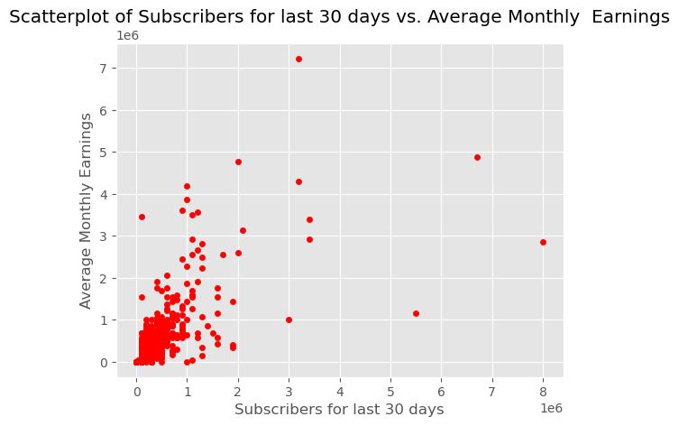

# **Youtube Earnings Prediction Project**
---

**Authors:**  
George Opondi  - $Team Leader$  
Ida Chepngeno  
Kennedy Owino  
Edwin Mwai  
Cynthia Chepkosgei  
Kevan Ndwiga  
Colins Chumba  
Cynthia Kendi

## **Problem Statement**
---
The success of content creators on YouTube is often associated with various factors such as the number of views, engagement metrics, and the audience's demographics. This project seeks to develop a predictive model that estimates a YouTuber's earnings based on key performance indicators and other relevant factors. The goal is to provide content creators and stakeholders with a tool that offers insights into potential earnings, aiding in strategic decision-making and content optimization.

## **Main Objective**

Develop a robust and accurate linear regression model to predict average YouTube earnings for content creators, leveraging key performance indicators and relevant factors, in order to empower content creators with actionable insights for optimizing their content strategy and maximizing revenue on the YouTube platform.

### Specific Objectives

1. **Exploratory Data Analysis and Data Pre-Processing:** Perform EDA on the data to better understand the dataset. Clean and preprocess the dataset to handle missing values, outliers, and any other data inconsistencies.
2. **Model Development:** Apply linear regression modeling techniques to establish a relationship between the chosen independent variables and YouTube earnings.
3. **Feature Selection:** Identify and select the most significant independent variables that have a significant impact on earnings. 
4. **Assess Model Perfomance:** Estimate and Interprate the co-efficient of the significant predictor variables
5. **Interpretation of Results:** Interpret the coefficients of the regression model to understand the relative importance of each independent variable in predicting YouTube earnings. Provide insights into the factors that most strongly influence earnings.

### Visualizations of our analysis

### Interpretation of the Model Results

Adjusted R-squared (0.764) indicates that approximately 76% of the variation in the average monthly earnings of a YouTube channel can be explained by the independent variables `video_views_for_the_last_30_days`, `subscribers_for_last_30_days`, `video_views`, and `subscribers`.

The model is statistically significant, suggesting that the combination of independent variables significantly predicts the average monthly earnings of a YouTube channel.

All coefficients in the model are statistically significant at the 5% level of significance.

The intercept, which is 43640, represents the average monthly earnings of a YouTube channel when all independent variables (`video_views_for_the_last_30_days`, `subscribers_for_last_30_days`, `video_views`, and `subscribers`) are zero. However, the interpretation of the intercept in this context may be nonsensical as it implies earning without any activity on the channel.

For the variable `video_views_for_the_last_30_days`, the coefficient 0.0005 indicates that for every one-unit increase in the number of video views in the last 30 days, there is an approximate increase of $0.0005 in the average monthly earning of the YouTube channel, holding all other variables constant.

For the variable `subscribers_for_last_30_days`, the coefficient of 0.614 indicates that the estimated increase in the average monthly earnings of the YouTube channel is approximately $0.614 for every one-unit increase in the number of subscribers in the last 30 days, while holding all other variables constant.

For the variable `video_views`, the coeffiecient 0.00024 indicates that for every one-unit increase in the number of video views, there is an aproximate increase of $0.00024 in the average monthly earning of the YouTube channel while holding all other variables constant.

For the variable `subscribers`,the coefficient of -0.0109 indicates that for every one unit increase in the number of the channel subscribers, there is an aproximate decrease in of 0.01 in the average monthly earning of the YouTube channel, holding all the other variable constant.

## **Conclusions**
---
Based on the provided model results, here are some of conclusions that can be drawn from the project:

$i).$ **Key Predictors of Average Monthly Earnings:** The independent variables `video_views_for_the_last_30_days`, `subscribers_for_last_30_days`, `video_views`, and `subscribers` are significant predictors of the average monthly earnings of a YouTube channel. Specifically, an increase in the number of video views and subscribers, both within the last 30 days and overall, positively impacts the average monthly earnings. 

$ii).$ Since earning on a YouTube channel typically requires some level of activity (e.g., video uploads, subscriber engagement), the intercept value of $43,640 when all variables are zero may not be practically relevant for this model.  

$iii).$ The model provides valuable insights into the factors influencing the average monthly earnings of a YouTube channel, with subscriber count and recent video views being the most influential variables. However, the negative impact of subscribers on earnings suggests a potential need for further investigation into subscriber engagement or other factors influencing this relationship. 
$iv).$ The results from the ANOVA tests indicate that there is a statistically significant difference in average monthly earnings across different channel types and countries.

## **Recommendation**
---

$i).$ Given that this project is based on a dataset comprising 995 records, it is advisable for future projects to consider incorporating a larger dataset to enhance the accuracy of the predictive model for individual YouTube earnings. 
$ii).$ Future projects should explore the the magnitude of both channel type and country on the average earning of a YouTube channel.